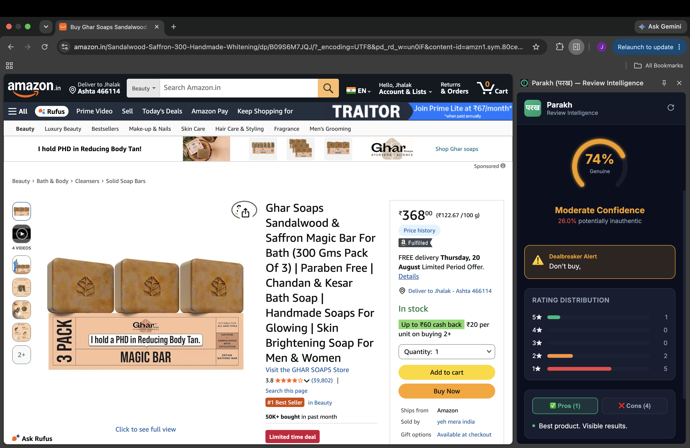
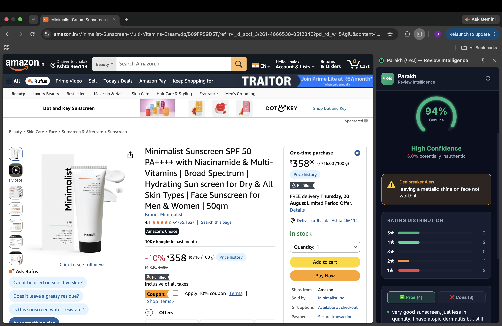

# Parakh (परख) — AI Review Intelligence Extension 🕵️‍♂️📦

Parakh is a Manifest V3 Chrome Extension powered by Google Gemini AI and FastAPI that analyzes e-commerce product reviews to detect fake reviews, extract genuine pros and cons, and warn users about dealbreakers.

Supported on 9 platforms including **Amazon, Flipkart, Myntra, Nykaa, and Meesho.**

## 📸 See it in Action

<!-- Replace the filenames below with your actual screenshot filenames -->

## 🚀 Features
* **Authenticity Scoring:** Uses NLP to detect incentivized and fake reviews.
* **Smart Summaries:** Gemini 2.0 Flash reads up to 30 reviews and extracts genuine Pros, Cons, and Dealbreakers.
* **Multi-Platform Support:** Works seamlessly across 9 major Indian e-commerce sites.
* **Sub-Second Performance:** Asynchronous backend processing and TTL caching for instant results.

## 🛠️ Tech Stack
* **Frontend:** Chrome Extensions API (Manifest V3), React, Vanilla CSS
* **Backend:** FastAPI, Python, TextBlob
* **AI:** Google Gemini 2.0 Flash

## ⚙️ How to Run Locally
1. Clone this repository.
2. Open Chrome and go to `chrome://extensions/`
3. Enable **Developer Mode** (top right).
4. Click **Load Unpacked** and select the `extension/dist` folder.
5. Pin the extension and try it on any supported product page!
